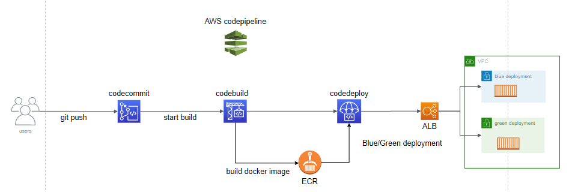

# CI/CD pipeline implementation with terraform on AWS

Project:

Make CI/CD pipeline for a Django web application From git repo to deployment :

- using Terraform to setup and deploy our infrastrucure in AWS, file "main.tf"
- building docker image from our django app with Dockerfile and codebuild
- pushing docker image to ECR
- Blue/Green ECS deployment with codedeploy

